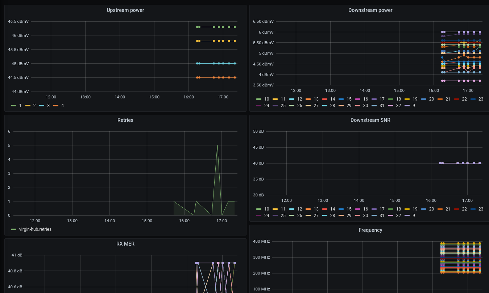

Utility for grabbing the connection stats from a Virgin Superhub 3 and sending them to an InfluxDB database for visualisation in Grafana.

Note that this has been hardcoded to read data for 24 downstream and 4 upstream channels because that's what my hub happens to use.

## Usage
Build with
```bash
cargo build --release
```

```
USAGE:
    virgin-hub3-stats [OPTIONS]

FLAGS:
    -h, --help       Prints help information
    -V, --version    Prints version information

OPTIONS:
        --hub <hub>                    [default: 192.168.100.1]
        --influxdb <influxdb>          [default: [::1]:8086]
        --max-retries <max-retries>    [default: 10]
```

Expected use case is to run this from a cron job:
```cron
# m h  dom mon dow   command
*/10 * * * * /root/virgin-hub3-stats --influxdb='[::1]:8089'
```

## Example dashboard


There is an example Grafana dashboard in [dashboard.json](dashboard.json).

## License

Licensed under either of

 * Apache License, Version 2.0
   ([LICENSE-APACHE](LICENSE-APACHE) or http://www.apache.org/licenses/LICENSE-2.0)
 * MIT license
   ([LICENSE-MIT](LICENSE-MIT) or http://opensource.org/licenses/MIT)

at your option.

## Contribution

Unless you explicitly state otherwise, any contribution intentionally submitted
for inclusion in the work by you, as defined in the Apache-2.0 license, shall be
dual licensed as above, without any additional terms or conditions.